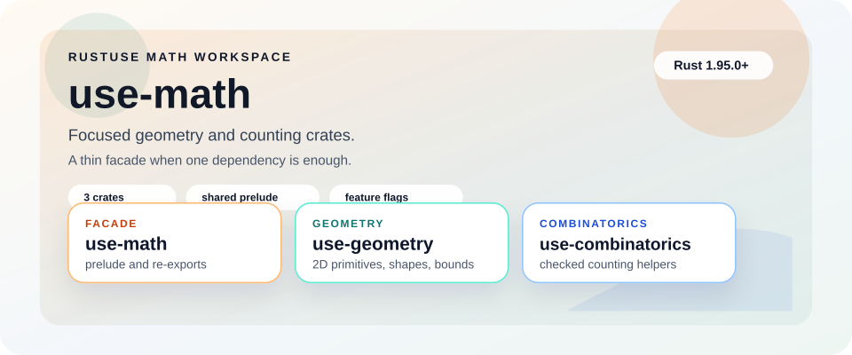

# RustUse/use-math

<p align="center">
	
</p>

<p align="center">
	
	
	
	
	
</p>

<p align="center">
	<strong>Utility-first Rust math crates for geometry, checked counting, and a feature-gated facade.</strong><br>
	Focused crates stay small. The facade crate composes them behind opt-in features and a shared <code>prelude</code>.
</p>

<p align="center">
	<a href="#what-this-workspace-ships">Workspace</a> ·
	<a href="#choose-your-entry-point">Choose a crate</a> ·
	<a href="#project-structure">Structure</a> ·
	<a href="#installation">Installation</a> ·
	<a href="#quick-examples">Examples</a> ·
	<a href="#feature-model">Features</a> ·
	<a href="#development">Development</a> ·
	<a href="#community-and-project-policy">Community</a>
</p>

This repository is the source workspace for RustUse's initial math surface. It pairs two focused crates, `use-geometry` and `use-combinatorics`, with the `use-math` facade for callers who want one dependency and feature-gated re-exports. The design bias is simple: small APIs, predictable dependencies, and validated constructors where external input can go wrong.

<table>
	<tr>
		<td width="33%" valign="top">
			<strong>Pull in one facade</strong><br>
			<code>crates/use-math/</code><br>
			Reach for the shared <code>prelude</code> and feature flags when one dependency is the cleanest integration point.
		</td>
		<td width="33%" valign="top">
			<strong>Keep geometry focused</strong><br>
			<code>crates/use-geometry/</code><br>
			Use points, vectors, lines, segments, circles, triangles, bounds, orientation, and distance helpers directly.
		</td>
		<td width="33%" valign="top">
			<strong>Keep counting focused</strong><br>
			<code>crates/use-combinatorics/</code><br>
			Use checked factorial, permutations, and combinations helpers without pulling in geometry types.
		</td>
	</tr>
</table>

## What this workspace ships

RustUse/use-math is a multi-crate workspace. Each crate is usable on its own, and the facade crate composes the focused crates when you want one import surface.

| Crate               | Path                        | Purpose                                                                                 | Best fit                                   |
| ------------------- | --------------------------- | --------------------------------------------------------------------------------------- | ------------------------------------------ |
| `use-math`          | `crates/use-math/`          | Feature-gated facade with direct re-exports and a shared `prelude`                      | One dependency and one import surface      |
| `use-geometry`      | `crates/use-geometry/`      | Utility-first 2D geometry primitives, shapes, bounds, orientation, and distance helpers | Geometry is the only math surface you need |
| `use-combinatorics` | `crates/use-combinatorics/` | Checked counting helpers for factorials, permutations, and combinations                 | You only need combinatorics helpers        |

| If you need to...                                           | Start here                 |
| ----------------------------------------------------------- | -------------------------- |
| Add one dependency and opt into math surfaces with features | `use-math`                 |
| Validate 2D coordinates and shapes from user or file input  | `use-geometry`             |
| Do checked counting without geometry types                  | `use-combinatorics`        |
| Keep the dependency and API surface as narrow as possible   | The focused crate directly |

> [!TIP]
> Prefer the focused crates when you want the narrowest dependency footprint. Choose `use-math` when consumer ergonomics and one-dependency integration matter more than shaving every unused surface.

## Choose your entry point

Pick the crate based on the integration shape you want, not just the total feature count.

| You want...                                   | Choose...                                        | Why                                                                                       |
| --------------------------------------------- | ------------------------------------------------ | ----------------------------------------------------------------------------------------- |
| One dependency for geometry and combinatorics | `use-math`                                       | The facade re-exports focused crates behind feature flags and exposes a unified `prelude` |
| Geometry-only code with direct type access    | `use-geometry`                                   | You avoid facade indirection and keep dependencies minimal                                |
| Counting helpers only                         | `use-combinatorics`                              | You get checked math helpers without bringing in geometry modules                         |
| Maximum control over enabled API surface      | A focused crate, or `use-math` with defaults off | You choose exactly which modules compile into the final build                             |

## Project structure

```text
.
├── Cargo.toml
├── README.md
├── crates/
│   ├── use-combinatorics/
│   │   ├── examples/
│   │   ├── src/
│   │   └── tests/
│   ├── use-geometry/
│   │   ├── examples/
│   │   ├── src/
│   │   └── tests/
│   └── use-math/
│       ├── examples/
│       ├── src/
│       └── tests/
└── scripts/
```

| Path                        | Role                                                                             |
| --------------------------- | -------------------------------------------------------------------------------- |
| `Cargo.toml`                | Workspace membership, shared package metadata, release metadata, and lint policy |
| `crates/use-math/`          | Feature-gated facade crate that re-exports the focused crates                    |
| `crates/use-geometry/`      | Direct 2D geometry APIs, validated constructors, and invariant checks            |
| `crates/use-combinatorics/` | Direct checked counting APIs                                                     |
| `scripts/`                  | Workspace automation and mirror sync helpers                                     |

## Installation

When consuming the published release line, pull in the smallest surface that matches your application.

Facade crate with default features:

```toml
[dependencies]
use-math = "0.0.1"
```

Facade crate with geometry only:

```toml
[dependencies]
use-math = { version = "0.0.1", default-features = false, features = ["geometry"] }
```

Focused crates directly:

```toml
[dependencies]
use-geometry = "0.0.1"
use-combinatorics = "0.0.1"
```

> [!NOTE]
> The workspace is still pre-1.0. Release sequencing matters because the `use-math` facade depends on matching focused-crate versions.

## Quick examples

### Geometry through the facade

```rust
use use_math::prelude::*;

let origin = Point2::try_new(0.0, 0.0)?;
let point = Point2::try_new(3.0, 4.0)?;
let distance = distance_2d(origin, point);
let midpoint = midpoint_2d(origin, point);

assert_eq!(distance, 5.0);
assert_eq!(midpoint, Point2::try_new(1.5, 2.0)?);
# Ok::<(), use_math::geometry::GeometryError>(())
```

### Checked counting through the facade

```rust
use use_math::prelude::*;

assert_eq!(factorial(5)?, 120);
assert_eq!(permutations(5, 3)?, 60);
assert_eq!(combinations(5, 2)?, 10);
# Ok::<(), use_math::combinatorics::CombinatoricsError>(())
```

### Direct geometry types

```rust
use use_math::geometry::{Circle, Point2, Triangle};

let a = Point2::try_new(0.0, 0.0)?;
let b = Point2::try_new(4.0, 0.0)?;
let c = Point2::try_new(0.0, 3.0)?;
let triangle = Triangle::try_new(a, b, c)?;
let circle = Circle::try_new(a, 3.0)?;

assert_eq!(triangle.area(), 6.0);
assert_eq!(circle.radius(), 3.0);
# Ok::<(), use_math::geometry::GeometryError>(())
```

## Validated input path

Use `try_new` constructor variants when coordinates or shapes originate outside your codebase, such as user input, configuration files, or network payloads. Infallible constructors like `Point2::new(...)` or `Aabb2::from_points(...)` remain available for values you already trust.

> [!IMPORTANT]
> Keep validation at the edge. Once data is trusted, the APIs stay lightweight and composable.

## Feature model

The facade crate exposes a small feature surface:

| Feature         | Enables                                                                     | Default |
| --------------- | --------------------------------------------------------------------------- | ------- |
| `geometry`      | Re-exports from `use-geometry` and geometry facade examples/tests           | No      |
| `combinatorics` | Re-exports from `use-combinatorics` and combinatorics facade examples/tests | No      |
| `full`          | `geometry` and `combinatorics` together                                     | Yes     |

If you want the facade but only one module, disable defaults and enable the feature you need:

```toml
[dependencies]
use-math = { version = "0.0.1", default-features = false, features = ["combinatorics"] }
```

## Maturity and release model

RustUse/use-math is intentionally pre-1.0. The current release line is `0.0.x`, and the facade crate should publish only after the focused crates for that same version are available to the registry index.

| Release concern   | Current posture                                       |
| ----------------- | ----------------------------------------------------- |
| Versioning        | Lockstep `0.0.x` releases across the workspace        |
| Publish order     | Publish focused crates first, then publish `use-math` |
| API growth        | Favor small, composable surfaces over rapid expansion |
| Dependency policy | Keep dependencies minimal and predictable             |

## Development

Run commands from the repository root.

Requirements:

```text
Rust 1.95.0 or newer
cargo
```

Repo-owned DX shortcuts:

```sh
cargo xcheck
cargo xlint
cargo xtest
cargo xtest-minimal
cargo xexamples
cargo xdoc
```

These aliases live in `.cargo/config.toml`, so contributors do not need `make`
for the common workspace validation path. If you are using VS Code, the same
flows are available through the checked-in tasks in `.vscode/tasks.json`, and
the repository recommends the Rust, TOML, YAML, and GitHub Actions extensions it
expects through `.vscode/extensions.json`.

Open-source intake and onboarding:

- GitHub issue forms now cover bugs, feature requests, and docs/onboarding gaps.
- The issue chooser routes questions and design exploration toward Discussions once the public repository enables them.
- The pull request template now asks for linked issue or discussion context, change type, and the repo-owned Cargo alias checks.

Optional maintainer and contributor tooling bootstrap:

```sh
bash scripts/bootstrap-dev-tools.sh
pwsh -File scripts/bootstrap-dev-tools.ps1
```

Both scripts install the optional Cargo tools used across local advisory,
release, and supply-chain workflows: `cargo-deny`, `cargo-audit`,
`cargo-cyclonedx`, `release-plz`, and `cargo-machete`.

If you prefer a containerized setup, the repository also ships a checked-in
devcontainer in `.devcontainer/` with the Rust toolchain, recommended VS Code
extensions, and an initial `cargo xcheck` post-create validation.

Primary validation commands:

```sh
cargo fmt --all --check
cargo check --workspace --all-features
cargo check --workspace --all-features --examples
cargo test --workspace --all-features
cargo test --workspace --no-default-features
cargo clippy --workspace --all-targets --all-features -- -D warnings
cargo doc --workspace --all-features --no-deps
cargo deny check
cargo audit
```

Convenience targets for the release path:

```sh
make help
make verify
make examples
make test-minimal
make publish-dry-run-focused
make release-readiness
```

`make release-readiness` intentionally validates the focused crates' publish
surface first. The `use-math` facade still needs its final `cargo publish
--dry-run` only after matching `use-geometry` and `use-combinatorics` versions
exist in the crates.io index.

If you prefer not to use `make`, the Cargo aliases and VS Code tasks cover the
same day-to-day validation flows cross-platform.

`Cargo.lock` is committed intentionally for reproducible CI, advisory checks, and release dry runs in this library workspace.

## Mirrors

The canonical repository is hosted on GitHub. Additional mirrors can be activated for redundancy and contributor access once their repository variables and SSH key material are configured.

See `FORGES.md` for the cross-forge sync model and mirror activation details.

## Contributing

Contributions should favor correctness, clear naming, small APIs, and minimal dependencies over broad surface area. See `CONTRIBUTING.md` for validation, release, and cross-forge expectations.

## Community and project policy

- Use `SUPPORT.md` for help and routing guidance.
- Use `SECURITY.md` for private vulnerability reporting.
- Use `CODE_OF_CONDUCT.md` for collaboration expectations.
- Use `GOVERNANCE.md` and `MAINTAINERS.md` for decision-making and release authority.

## License

Licensed under MIT OR Apache-2.0. See `LICENSE-MIT` and `LICENSE-APACHE`.
